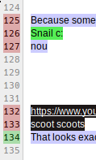

Show lines where recent changes have occured in etherpad lite.

Example:

This is **very old code** from ~2014 that I am not going to maintain. I don't
claim it's any good. No sense in not sharing it, though!

Requires [a `linechanged` hook][linechanged] in etherpad.

[linechanged]: https://github.com/amfl/etherpad-lite/tree/linechanged
